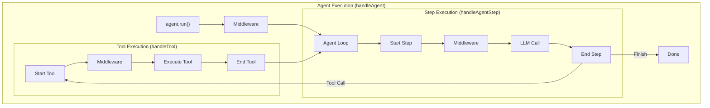

# Middleware

Middleware provides a powerful way to intercept and modify the execution of agents, tools, and individual LLM steps. It enables cross-cutting concerns like logging, caching, retries, and context modification without changing your core agent logic.

## Core Concepts

The middleware system is built around the `Middleware<Context, Yield>` interface, which provides three distinct interception points:

1. **`handleAgent`** - Wraps the entire agent execution.
2. **`handleTool`** - Wraps individual tool executions.
3. **`handleAgentStep`** - Wraps individual LLM steps within the agent loop.

All handlers are optional. If a handler is not provided, the middleware simply passes execution to the next handler in the chain.

### Execution Flow



## The Three Handlers

### 1. Agent Handler (`handleAgent`)

Wraps the entire `agent.run()` call. This is useful for:

- Setting up request-scoped context
- Caching entire agent runs
- Logging start/end of execution
- Global error handling

**Context:** `AgentMiddlewareContext`

- `env`: Runner environment (readonly)
- `memory`: Agent memory (mutable)
- `prompt`: The initial prompt
- `context`: Application context

```typescript
async *handleAgent(c, next) {
  console.log("Agent starting")
  const result = yield* next(c)
  console.log("Agent finished")
  return result
}
```

### 2. Tool Handler (`handleTool`)

Wraps every tool invocation. This is useful for:

- Input validation or transformation
- Output sanitization
- Tool-level logging or metrics
- Mocking tools for testing

**Context:** `ToolMiddlewareContext`

- `tool`: The tool definition (readonly)
- `input`: Tool input arguments
- `context`: Application context

```typescript
async *handleTool(c, next) {
  console.log(`Calling tool ${c.tool.name} with input:`, c.input)
  return yield* next(c)
}
```

### 3. Step Handler (`handleAgentStep`)

Wraps each iteration of the agent loop (each LLM call). This is useful for:

- Per-step retries (e.g., on rate limits)
- Model fallback strategies
- Modifying the system prompt or model dynamically per step
- Inspecting intermediate generated content

**Context:** `AgentStepMiddlewareContext`

- `step`: Current step number (1-indexed, readonly)
- `model`: The language model (mutable - can be swapped)
- `system`: System prompt (mutable)
- `tools`: Available tools (mutable)
- `memory`: Memory instance (mutable)

```typescript
async *handleAgentStep(c, next) {
  // Swap model for step 2
  if (c.step === 2) {
    return yield* next({...c, model: specializedModel})
  }else{
    return yield* next(c)
  }
}
```

## Creating Middleware

Middleware is defined as a function that returns a `Middleware` object. Handlers are async generators that must use `yield*` to delegate to the `next` function.

### Basic Pattern

```typescript
import type { Middleware } from "@gumbee/agent"

export function myMiddleware(): Middleware {
  return {
    async *handleAgent(c, next) {
      // Pre-processing

      // Delegate to next (REQUIRED)
      const result = yield* next(c)

      // Post-processing

      return result
    },
  }
}
```

### Propagation Control

By default, middleware only applies to the agent it is explicitly configured on. It does **not** automatically descend into sub-agents. For tools, if `handleTool` is defined it automatically applies to tools owned by the origin agent. You can control sub-agent descent and descendant-tool descent using propagation methods:

```typescript
export function pervasiveMiddleware(): Middleware {
  return {
    // ... handlers ...

    // Apply to all sub-agents
    shouldDescendIntoAgent: (info) => true,

    // Apply to all tools called by sub-agents
    shouldDescendIntoTool: (info) => true,
  }
}

export function twoLayerMiddleware(): Middleware {
  return {
    // ... handlers ...

    // Apply to all immediate sub-agents
    shouldDescendIntoAgent: (info) => info.parent === info.origin,

    // Apply to all tools called by sub-agents we descended into
    shouldDescendIntoTool: (info) => true,
  }
}
```

The `info` parameter provides context about the propagation decision:

**`shouldDescendIntoAgent(info)`** receives:

| Property    | Type    | Description                                              |
| ----------- | ------- | -------------------------------------------------------- |
| `origin`    | `Agent` | The agent where this middleware was originally attached  |
| `parent`    | `Agent` | The current parent agent invoking the candidate subagent |
| `candidate` | `Agent` | The candidate child agent being considered for descent   |

**`shouldDescendIntoTool(info)`** receives:

| Property    | Type    | Description                                             |
| ----------- | ------- | ------------------------------------------------------- |
| `origin`    | `Agent` | The agent where this middleware was originally attached |
| `parent`    | `Agent` | The current agent invoking the candidate tool           |
| `candidate` | `Tool`  | The candidate tool being considered for descent         |

This gives you fine-grained control over which sub-agents and tools a middleware applies to:

## Custom Yields

Middleware can emit custom events into the agent's event stream. This is useful for adding domain-specific telemetry, progress indicators, retry notifications, or any application-specific events.

### Defining Custom Yield Types

Define your custom event types as plain objects with a `type` discriminant:

```typescript
type MyProgressYield = {
  type: "my-progress"
  percentage: number
  message: string
}

type MyMetricYield = {
  type: "my-metric"
  name: string
  value: number
}

type MyCustomYields = MyProgressYield | MyMetricYield
```

### Emitting Custom Yields from Middleware

Pass your custom yield type as the second generic parameter to `Middleware<Context, Yield>`:

```typescript
import type { Middleware, AgentMiddlewareResult } from "@gumbee/agent"

function progressMiddleware<Context = any>(): Middleware<Context, MyCustomYields> {
  return {
    async *handleAgent(c, next) {
      yield { type: "my-progress", percentage: 0, message: "Starting..." }

      const result = yield* next(c)

      yield { type: "my-progress", percentage: 100, message: "Done!" }

      return result
    },
  }
}
```

Custom yields can be emitted from any handler -- `handleAgent`, `handleTool`, or `handleAgentStep`:

```typescript
function retryTracker<Context>(): Middleware<Context, RetryYield> {
  return {
    async *handleAgentStep(c, next) {
      try {
        return yield* next(c)
      } catch (error) {
        yield { type: "step-retry", step: c.step, error: String(error) }
        throw error
      }
    },
  }
}
```

### Metadata Injection

The runtime automatically injects metadata fields onto every yielded event -- including custom yields. You do not need to manually add `path`, `timestamp`, `nodeId`, or `parentId` to your custom events. They are injected as the event passes through the middleware chain:

```typescript
// You yield this:
yield { type: "my-progress", percentage: 50, message: "Halfway" }

// The consumer receives this (WithMetadata<MyProgressYield>):
{
  type: "my-progress",
  percentage: 50,
  message: "Halfway",
  path: ["root", "my-agent"],      // injected
  timestamp: 1234.56,              // injected
  nodeId: "abc-123",               // injected
  parentId: "root-456",            // injected
}
```

The `WithMetadata<T>` type describes this:

```typescript
type YieldMetadata = { path: string[]; timestamp: number; nodeId: string; parentId?: string }
type WithMetadata<T extends { type: string }> = T & YieldMetadata
```

### Consuming Custom Yields

Custom yields appear alongside built-in events in the agent's `stream`. The stream type is `AsyncGenerator<WithMetadata<RuntimeYield<Yield>>>`:

```typescript
const { stream } = myAgent.run("Hello", context)

for await (const event of stream) {
  switch (event.type) {
    case "agent-stream":
      // Built-in event
      break
    case "my-progress":
      // Custom yield from middleware -- fully typed
      console.log(`Progress: ${event.percentage}% - ${event.message}`)
      break
  }
}
```

### Real-World Example: Fallback Middleware

The built-in `fallback` middleware uses custom yields to emit retry notifications. This is a good reference for how custom yields work in practice:

```typescript
import type { Middleware, AgentStepMiddlewareContext, AgentStepMiddlewareResult } from "@gumbee/agent"
import type { AgentStepRetryYield } from "@gumbee/agent"

export function fallback<Context>(options: FallbackMiddlewareOptions): Middleware<Context, AgentStepRetryYield> {
  return {
    async *handleAgentStep(
      c: AgentStepMiddlewareContext<Context>,
      next: (c: AgentStepMiddlewareContext<Context>) => AgentStepMiddlewareResult<AgentStepRetryYield>,
    ): AgentStepMiddlewareResult<AgentStepRetryYield> {
      // ... retry logic ...

      // Emit a custom event when retrying with fallback model
      yield {
        type: "agent-step-retry",
        step: c.step,
        attempt: attempt + 1,
        error: err.message,
        toModelId: "fallback-model-id",
        toProvider: "fallback-provider",
      }

      // ... continue retry ...
    },
  }
}
```

The `AgentStepRetryYield` type is exported from `@gumbee/agent` and defined as:

```typescript
type AgentStepRetryYield = {
  type: "agent-step-retry"
  step: number
  attempt: number
  error: string
  toModelId: string
  toProvider: string
}
```

## TypeSafety

### Prefer TypeScript Inference

When writing middleware, **let TypeScript infer types wherever possible**. Explicit generic annotations are rarely needed and can actually make your code harder to maintain.

The `Middleware` interface is designed so that handler parameter types flow automatically from the generic parameters you provide. In most cases, you only need to annotate the top-level `Middleware<Context, Yield>` return type and let inference handle everything inside:

```typescript
// Let inference do the work -- handler parameters are inferred
function logging<Context>(): Middleware<Context> {
  return {
    async *handleAgent(c, next) {
      // c is inferred as AgentMiddlewareContext<Context>
      // next is inferred as (c: AgentMiddlewareContext<Context>) => AgentMiddlewareResult<Context>
      console.log("Agent starting")
      return yield* next(c)
    },

    async *handleTool(c, next) {
      // c is inferred as ToolMiddlewareContext<Context, Input>
      console.log(`Tool: ${c.tool.name}`)
      return yield* next(c)
    },
  }
}
```

This approach has several advantages:

1. **Less noise** -- handler signatures stay concise and readable.
2. **Refactor-safe** -- if the library's types change, inference adapts automatically.
3. **Fewer mistakes** -- you can't accidentally annotate the wrong type.

### When You Need Explicit Annotations

There are cases where you _do_ need explicit type annotations:

**1. When manually iterating the `next()` generator** instead of using `yield*`:

If you need to inspect or transform individual events from `next()`, you must manually iterate the generator. In this case, annotate the handler return type so TypeScript knows what the generator yields:

```typescript
function observability(serverUrl: string): Middleware {
  return {
    async *handleAgent(c, next): AgentMiddlewareResult {
      const stream = next(c)

      // Manual iteration -- need explicit return type
      let result: IteratorResult<RuntimeYield, { context: any }>
      while (!(result = await stream.next()).done) {
        // Process each event individually
        sendToServer(result.value)
        yield result.value
      }

      return result.value
    },
  }
}
```

**2. When using custom yields with manual iteration:**

```typescript
function tracked<Context = any>(): Middleware<Context, MyCustomYield> {
  return {
    async *handleAgent(c, next): AgentMiddlewareResult<Context, MyCustomYield> {
      yield { type: "my-event", data: "start" }

      // Manual iteration with custom yield type
      const stream = next(c)
      let result = await stream.next()
      while (!result.done) {
        yield result.value
        result = await stream.next()
      }

      yield { type: "my-event", data: "end" }
      return result.value
    },
  }
}
```

**3. When the context type is concrete** (not generic):

If your middleware is specific to a particular application context, use the concrete type:

```typescript
type AppContext = { userId: string; db: Database }

function appSpecific(): Middleware<AppContext> {
  return {
    async *handleAgent(c, next) {
      // c.context is typed as AppContext
      console.log("User:", c.context.userId)
      return yield* next(c)
    },
  }
}
```

### Summary

| Scenario                              | Approach                                                                 |
| ------------------------------------- | ------------------------------------------------------------------------ |
| Simple pass-through with `yield*`     | Let inference work -- no annotations needed inside handlers              |
| Manual `next()` iteration             | Annotate handler return type (e.g. `AgentMiddlewareResult`)              |
| Custom yields                         | Annotate `Middleware<Context, Custom>` return type from factory function |
| Custom yields + manual iteration      | Annotate both `Middleware<Context, Custom>` and handler return types     |
| Concrete context type                 | Annotate `Middleware<AppContext>` -- handler internals still inferred    |
| Generic context (reusable middleware) | Use `<Context>()` on factory function -- inference handles the rest      |

## Registration

Middleware can be registered in two ways:

### 1. Agent Configuration (Persistent)

```typescript
const myAgent = agent({
  name: "helper",
  middleware: [logging(), fallback({ model: backupModel })],
})
```

### 2. Runtime Options (Per-request)

Runtime middleware runs _inside_ the config middleware (closer to the core logic).

```typescript
agent.run("Hello", context, {
  middleware: [requestSpecificMiddleware()],
})
```

## Built-in Middleware

### Fallback

The `fallback` middleware provides resilience by retrying failed LLM steps with a backup model. It only retries if the failure occurs before any content is generated, ensuring no partial output is lost. On retry, it emits an `agent-step-retry` custom yield so consumers can track model failover.

```typescript
import { fallback } from "@gumbee/agent"
import { google } from "@ai-sdk/google"

const resilientAgent = agent({
  middleware: [fallback({ model: google("gemini-2.5-flash") })],
})
```

## Examples

### Logging Middleware

A middleware that logs activity at all levels.

```typescript
function logging(): Middleware {
  return {
    async *handleAgent(c, next) {
      console.log(`[Agent] Starting: ${c.prompt.substring(0, 50)}...`)
      const start = Date.now()
      try {
        return yield* next(c)
      } finally {
        console.log(`[Agent] Finished in ${Date.now() - start}ms`)
      }
    },

    async *handleAgentStep(c, next) {
      console.log(`[Step ${c.step}] Using model: ${c.model.modelId}`)
      return yield* next(c)
    },

    async *handleTool(c, next) {
      console.log(`[Tool] Calling ${c.tool.name}`)
      return yield* next(c)
    },

    shouldDescendIntoAgent: (_info) => true,
    shouldDescendIntoTool: (_info) => true,
  }
}
```

### Simple Caching

A middleware that caches agent results and replays them when possible.

```typescript
function simpleCache(): Middleware {
  return {
    async *handleAgent(c, next) {
      // Build the full message list from memory + current prompt
      const messages = await c.memory.read()
      const key = await cache.key(messages)

      if (cache.has(key)) {
        // Replay cached result if it exists
        return yield* cache.replay(key)
      }

      return yield* cache.record(key, next(c))
    },
  }
}
```

### Observability with Manual Iteration

A middleware that intercepts every event for telemetry, demonstrating manual generator iteration with explicit type annotations:

```typescript
function observability(serverUrl: string): Middleware {
  return {
    async *handleAgent(c, next): AgentMiddlewareResult {
      const traceId = c.env.runId
      const stream = next(c)

      let result: IteratorResult<RuntimeYield, { context: any }>
      while (!(result = await stream.next()).done) {
        // Send each event to telemetry server
        sendEvent(traceId, result.value)
        yield result.value
      }

      return result.value
    },

    shouldDescendIntoAgent: () => false,
    shouldDescendIntoTool: () => true,
  }
}
```

### Custom Yields with Multiple Handlers

A middleware that emits custom events from both agent and tool handlers:

```typescript
type BeforeYield = { type: "trace-before"; handler: string; name: string }
type AfterYield = { type: "trace-after"; handler: string; name: string }
type TraceYields = BeforeYield | AfterYield

function tracing<Context>(): Middleware<Context, TraceYields> {
  return {
    async *handleAgent(c, next) {
      yield { type: "trace-before", handler: "agent", name: "run" }
      const result = yield* next(c)
      yield { type: "trace-after", handler: "agent", name: "run" }
      return result
    },

    async *handleTool(c, next) {
      yield { type: "trace-before", handler: "tool", name: c.tool.name }
      const result = yield* next(c)
      yield { type: "trace-after", handler: "tool", name: c.tool.name }
      return result
    },
  }
}
```
